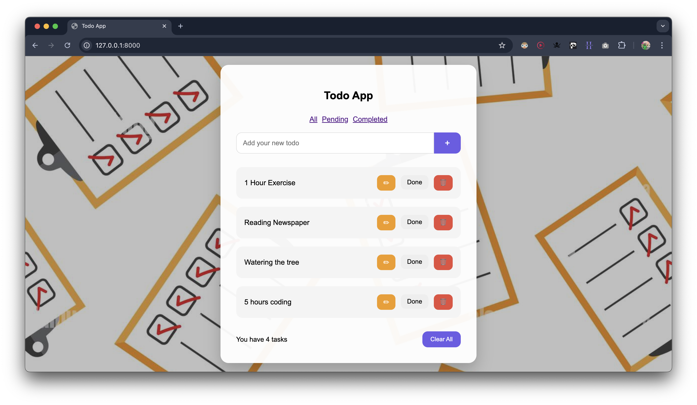
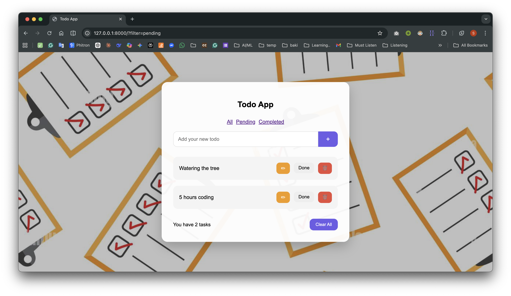

# 📝 Todo Web App (Django)

A simple and clean Todo web application built with Django. Users can
add, edit, delete, and manage tasks efficiently with status tracking and
filtering.

------------------------------------------------------------------------

## 🚀 Features

-   Add new tasks\
-   Edit existing tasks\
-   Delete tasks\
-   Mark tasks as completed / undo\
-   Filter tasks (All / Completed / Pending)\
-   Task count display

------------------------------------------------------------------------

## 🛠 Tech Stack

-   Backend: Django (Python)\
-   Frontend: HTML, CSS\
-   Database: SQLite

------------------------------------------------------------------------

## 📸 Screenshots

### Home Page

### Completed Task

### Filter View

------------------------------------------------------------------------

## 🎯 Future Improvements

-   User authentication (login/signup)
-   AJAX for instant updates
-   Due date & reminders
-   Dark mode

------------------------------------------------------------------------
